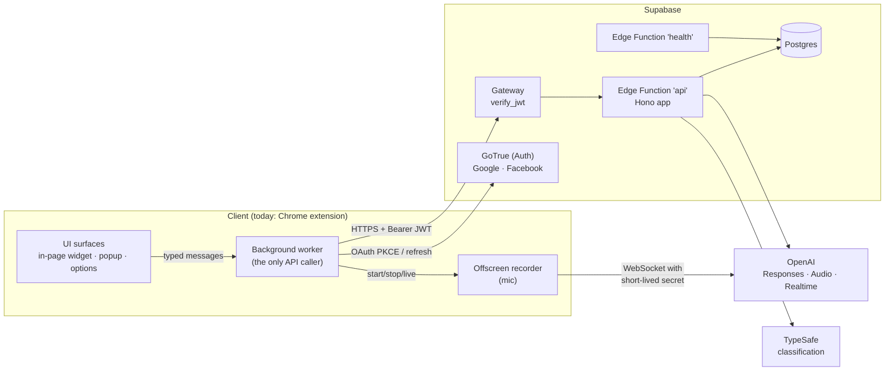

# AI Translator: system overview

This folder documents the system as **two separate parts with a contract between them**, so the backend
and the clients can change on their own schedules.

| Document | Scope |
| --- | --- |
| [api.md](api.md) | The backend: what it owns, how it is built and deployed, every endpoint, its data, auth, config |
| [frontend.md](frontend.md) | The **client as an abstract unit**: what any client (extension, desktop, mobile, web) must do to use the API, and which product logic currently lives client-side |
| [extension.md](extension.md) | The **Chrome extension** in particular: code structure, runtime contexts, messaging, browser APIs, storage, UI surfaces |

Snapshot taken 2026-10-01 from the `throttling-strategy` working tree (uncommitted changes included:
`/stats/dictation`, `core/liveLanguage.ts`, `core/sentenceFixes.ts`).

---

## 1. What the product does

A writing assistant that works **inside any text field on any web page** (and in its own toolbar popup):

| Feature | What the user sees |
| --- | --- |
| **Translate** | Select text → a floating icon → a menu of languages → the selection is replaced by the translation. Page text (outside fields) is translated into a read-only field with Copy. The source language is detected first and shown ("From: Polish"). |
| **Grammar fix** | A focused textarea / contenteditable gets a corner icon with a badge (number of errors, ✓, or a warning). Errors are underlined inline (red = error, blue = "a native speaker would say it differently"). Clicking opens a panel that walks the edits one by one: Replace / Ignore / Replace all. |
| **Wrong keyboard layout** | Text typed on the wrong layout (`ghbdtn` for `привет`) is recognised; one click re-types it locally. Random keystrokes (`adfasdf`) are recognised and nothing is sent to the AI for them. |
| **Voice input (dictation)** | Mic button in a field's hover pill or in the popup. Live text appears while speaking; on Stop, English goes to the grammar panel, a language the user usually translates goes straight to translation, anything else gets the language menu. Nothing is written into the page until **Insert**. |
| **Toolbar popup** | A small translator: type or dictate, pick a pair, translate, "Try another", copy or **Insert** into the page's focused field. Local history (200 entries), starred items, pinned languages, a per-site on/off switch. |
| **Options page** | Sign-in (Google / Facebook), favorite languages, disabled sites, fields turned off, microphone permission. |
| **Rewrite** | `natural` / `formal` restyle. **API only — no client UI yet.** |

All AI work (translation, detection, grammar, transcription) runs **on the API**; provider keys never
reach a client.

---

## 2. System map



Three outbound connections leave the client:
1. **API** (`/functions/v1/api/*`) — everything functional.
2. **Supabase Auth** (`/auth/v1/*`) — sign-in and token refresh only.
3. **OpenAI Realtime** (`wss://api.openai.com/v1/realtime`) — live dictation audio, authorised by a
   120 s client secret the API mints. This is the only place a client talks to a provider directly.

---

## 3. Responsibility split (target state)

| Concern | API | Client |
| --- | --- | --- |
| Provider choice, prompts, models, keys | **Owns** | Never sees them |
| Is this text a language? (guard: `mistyped` / `gibberish`) | **Decides** (422) | Renders the verdict; does the local re-type |
| Language detection, translation, grammar fix, error count, rewrite, transcription | **Owns** | Calls, caches, renders |
| Edit offsets of a grammar fix | **Computes** (server diff; the model's offsets are never trusted) | Applies them to its own text |
| Auth | Verifies (gateway) and reads `sub` | Runs OAuth, stores & refreshes tokens |
| Settings (`favoriteLanguages`, `disabledSites`) | **Source of truth** (`profiles.settings`) | Caches; fills empty favorites from the OS/browser languages |
| Rate limiting, input validation | **Owns** | — |
| Audit / analytics rows (`translations`, `detections`, …) | **Owns** | Supplies `url` (page) |
| History, stars, pinned languages, turned-off fields | — | **Local only** (by choice) |
| When to call (throttling, chunking text into sentences/paragraphs, prefetching, cancelling) | — | **Owns** |
| Microphone capture, audio encoding, live socket | Mints the secret; fallback `/transcribe` | **Owns** |
| Reading / writing the host app's text (DOM, selection, undo) | — | **Owns** (platform-specific) |

The contract between them is one file: [`shared/contract.ts`](../shared/contract.ts) (types + limits)
plus [`shared/contants.ts`](../shared/contants.ts) (the supported language list). Both sides import it
directly today; see [frontend.md §8](frontend.md#8-what-a-new-client-needs-and-what-is-in-the-way) for
what separating them would take.

---

## 4. Repository layout

```
ai-translator-ext/            npm workspaces: api, extension
  shared/                     wire contract, imported by both sides (no package of its own)
    contract.ts               request/response types, error codes, Settings, limits, regexes
    contants.ts               LANGUAGES (31 supported languages) + LANGUAGES_MAP   [sic: filename typo]
  api/                        backend (Hono on Supabase Edge Functions / local Node)
  extension/                  Chrome MV3 client (WXT + React 19 + HeroUI + Tailwind v4)
  supabase/                   config.toml (functions, auth providers), migrations/, seed.sql
  .claude/rules/              api-architecture.md, extension-ui.md — layer rules (authoritative)
  CLAUDE.md                   very detailed behavioural notes (some drift, see below)
  graphify-out/               generated knowledge graph of the code (tooling, not product)
```

---

## 5. Findings worth acting on before separating

Found while reading the code for this documentation. None are fixed here.

| # | Where | Finding |
| --- | --- | --- |
| 1 | `supabase/config.toml` `[functions.health]` | `entrypoint = "../api/src/health.ts"`, but the file is `api/dev/health.ts` (and `api/dev/` is documented as "never deployed"). Deploying `health` as configured should fail. |
| 2 | `api/src/controllers/{translate,detect,fix-grammar,rewrite}.ts` | The **success** save (`save({ result })`) is commented out; only failures are stored (fix-grammar stores nothing). Consequence: `detections.verified` (written by `/translate`) never finds a row to mark. Docs still describe every attempt as saved. |
| 3 | `api/src/resources/aiClient/requests/fix-grammar/fix-grammar.ts` | An AI request logs (`scopedLogger`), breaking the layer rule, and uses the **user's text as the log id**, so user text lands in log tags. |
| 4 | `extension/src/api.ts` vs `auth/oauth.ts` | API base defaults to `:8787` (local Node), auth base to `:54321` (local Supabase). CLAUDE.md says the API default is `:54321`. Works only if both are running. |
| 5 | `extension/wxt.config.ts` | `key` (pinned extension id) is commented out and `host_permissions` still has `https://<project-ref>.supabase.co/*`. Sign-in redirect and production API calls both depend on these. |
| 6 | `extension/src/messaging/messages.ts` | `rewrite` message is handled by the worker but has no sender (no UI). |
| 7 | `api/README.md` | Stale: refers to `src/translate.ts`, `src/openai.ts`, says detection is done by OpenAI (it is TypeSafe), lists no `/check`, `/fix-grammar`, `/transcribe`, `/voice-session`, `/stats`. [api.md](api.md) supersedes it. |
| 8 | `api/src/repositories/wordStats.ts` | `/stats` is a dev counter written to a local JSON file; on the edge it silently counts nothing. It is extension-driven telemetry living in the API. |
| 9 | Guard skipping | `/translate` skips the guard when `sourceLang` is sent, `/fix-grammar` when `guarded: true`. These are client-asserted. Cost exposure only (the client's own rate limit), but a new client must know the rule. |
