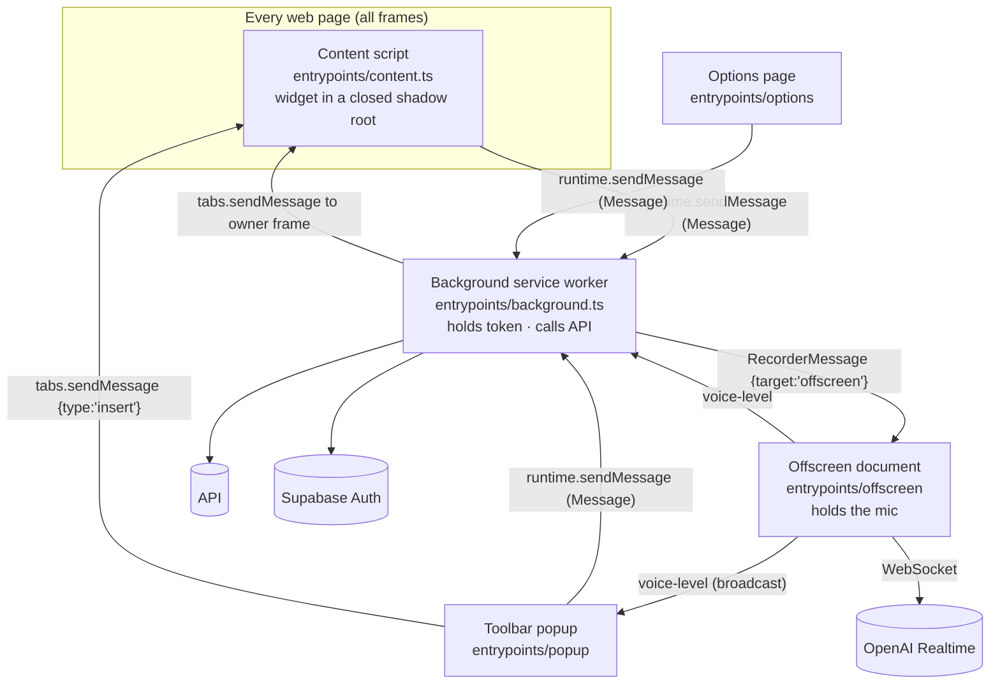

# Chrome extension

Today's only client: a Chrome **Manifest V3** extension built with **WXT 0.21**, **React 19**,
**HeroUI 3** and **Tailwind v4**. It implements every flow in [frontend.md](frontend.md); this
document covers what is specific to the browser.

- Code: [`extension/`](../extension) (`srcDir: src`, build output `extension/output/chrome-mv3`)
- UI layer rules (authoritative): [`.claude/rules/extension-ui.md`](../.claude/rules/extension-ui.md)

---

## 1. Runtime contexts

An MV3 extension is several isolated programs. Each one has a fixed job.



| Context | File | Responsibilities | Why here |
| --- | --- | --- | --- |
| **Background worker** | `src/entrypoints/background.ts` | The only API caller; access token + refresh; `url` from `sender.tab`; aborts in-flight requests by id; sign-in; settings pull/save; drives the recorder; forwards level ticks | `host_permissions` exempt it from page CORS and mixed content; `chrome.identity` only works here; a page can't forge `sender` |
| **Content script** | `src/entrypoints/content.ts` (`<all_urls>`, `allFrames`, `document_idle`) | Mounts the widget; answers the popup's `insert` | Needs the page DOM |
| **Toolbar popup** | `src/entrypoints/popup/` → `popups/toolbar/ToolbarPopup.tsx` | Standalone translator, history, pins, site switch, dictation, Insert | `action.default_popup` |
| **Options page** | `src/entrypoints/options/` → `popups/options/` | Sign-in, favorites, disabled sites, turned-off fields, mic permission (`#mic`) | The only context that can show the mic permission prompt for the extension |
| **Offscreen document** | `src/entrypoints/offscreen/` | `getUserMedia`, MediaRecorder file, PCM tap, Realtime socket, silence/60 s stop | Worker has no `getUserMedia`; a content script would ask every site for the mic |

The worker is killed between events: nothing is kept in memory across requests except the
`checks` abort map for in-flight calls. Tokens refresh on demand, never on a timer.

---

## 2. Manifest

From [`wxt.config.ts`](../extension/wxt.config.ts) (WXT generates the rest from entrypoints):

| Field | Value | Used for |
| --- | --- | --- |
| `permissions` | `storage` | `chrome.storage.local` (session, settings cache, history, pins, turned-off fields) |
| | `identity` | `launchWebAuthFlow` OAuth window |
| | `activeTab` | Popup reads the active tab's url (site switch) and messages it (Insert) |
| | `offscreen` | Mic recorder document (`USER_MEDIA` reason) |
| `host_permissions` | `http://127.0.0.1:8787/*`, `http://127.0.0.1:54321/*`, `https://<project-ref>.supabase.co/*` | API + Auth without CORS. ⚠ placeholder ref |
| `key` | commented out | Should pin the extension id so `https://<id>.chromiumapp.org/` matches the Supabase redirect allowlist |
| content script | `<all_urls>`, all frames | Widget everywhere |
| `action` | title only; popup from `entrypoints/popup` | |

Build-time env: `WXT_API_URL` (default `http://127.0.0.1:8787/functions/v1/api`),
`WXT_SUPABASE_URL` (default `http://127.0.0.1:54321`), `WXT_SUPABASE_ANON_KEY`.

---

## 3. Source layout

```
extension/
  wxt.config.ts  vitest.config.ts  tsconfig.json  .storybook/  playground/index.html
  src/
    api.ts                      the ONLY fetches to the API (worker-side), ApiError, 401-from-status
    entrypoints/                WXT mounts only: background.ts, content.ts, popup/, options/, offscreen/
    messaging/
      messages.ts               Message / ResponseMap / Response<T>, sendMessage()
      recorder.ts               RecorderMessage, RecorderReply, VoiceLevel (worker ↔ offscreen)
    auth/                       oauth.ts (PKCE, refresh), session.ts (storage item), providers.ts
    settings/                   chrome.storage items: storage-settings, history, pinned, disabled-fields
    core/                       pure, tested: languages, layout, sites, fixEdits, pcm, liveTranscript, liveLanguage, sentenceFixes
    content/                    DOM domain logic: selection.ts, replace.ts, insert.ts
    components/                 presentational, reusable: buttons, icons, inputs, typography, menu, list,
                                CountBadge, GrammarPanel, Recording, theme.css, color-scheme
    widgets/translator/         the in-page widget
      mount.ts                  closed shadow host
      Translator.tsx            container: useTranslatorFlow → toView → <TranslatorWidget>
      hooks/                    useTranslatorFlow (the whole flow, ~980 lines), usePageEvents, useSiteGate,
                                useUnderlines, chunkRequests, requestSlot
      state.ts view.ts position.ts chunks.ts shadow-css.ts   pure, tested
      TranslatorWidget.tsx Trigger.tsx panels/               presentational (+ stories)
    popups/
      toolbar/                  ToolbarPopup (container), hooks/ (useTranslation, useHistory, useActiveSite,
                                usePinned, useDictation, useGrammarFix), screens/ (Home, History, Languages, entries)
      options/                  OptionsApp (container), OptionsPage (presentational), useMicPermission
    demo/                       Storybook demo story
```

### Dependency rules

| Folder | May import | Must not import |
| --- | --- | --- |
| `components/` | React, HeroUI | `messaging/`, `settings/`, `auth/`, `content/`, `wxt/*` |
| `core/` | `shared/` | any surface, `chrome.*` (senders are passed in as parameters) |
| screens / panels / `TranslatorWidget` | `components/` | `sendMessage`, storage, timers |
| hooks | everything | — (they own messaging, storage, timers) |
| `entrypoints/` | — | logic (mount only) |

A piece moves to `components/` (or `core/`) only once a second surface uses it.

---

## 4. Messaging protocol

### 4.1 UI → worker (`messaging/messages.ts`)

All responses are `{ok: true, data} | {ok: false, error: {message, code?}}` (Errors don't survive
structured cloning). Adding a type = update `Message` **and** `ResponseMap`.

| `type` | Payload | Worker does | Response | Senders |
| --- | --- | --- | --- | --- |
| `translate` | `text, targetLang, sourceLang?, id?` | `POST /translate` (+ `url` from tab), abortable by `id` | `TranslateOk` | widget, popup |
| `detect` | `text` | `POST /detect` | `DetectOk` | widget, popup, dictation (live language) |
| `check` | `text, id` | `POST /check`, abortable | `CheckOk` | widget |
| `fix-grammar` | `text, id, guarded?` | `POST /fix-grammar`, abortable | `FixGrammarOk` | widget, popup, sentence fixes |
| `cancel` | `id` | aborts the matching fetch | `void` | widget, popup |
| `rewrite` | `text, style` | `POST /rewrite` | `RewriteOk` | **none (no UI)** |
| `voice-start` | — | ensure offscreen doc; `start`; mint `/voice-session` (not awaited) → `live` | `void` / `mic-blocked` | widget, popup |
| `voice-stop` | `lang?` | `stop`; live text ⇒ `{text, lang}` (detect if no `lang`); else upload to `/transcribe`; report `/stats/dictation` | `TranscribeOk` | widget, popup |
| `voice-cancel` | — | recorder `cancel` | `void` | widget, popup |
| `open-options` | — | `runtime.openOptionsPage()` | `void` | widget, popup |
| `sign-in` | `provider` | OAuth, then pull settings into cache | `Account` | widget, popup, options |
| `sign-out` | — | clear session | `void` | options |
| `get-account` | — | read session | `Account \| null` | options |
| `get-settings` | — | `GET /settings` → cache (cache on failure) | `Settings` | options, popup |
| `save-settings` | `settings` | `PUT /settings`, then cache | `Settings` | options, popup |

`asUser()` wraps API calls: fetches a fresh token; on `unauthenticated` it clears the session so the
next attempt prompts sign-in.

### 4.2 Worker ↔ offscreen recorder (`messaging/recorder.ts`)

`{target: 'offscreen', type: 'start' | 'stop' | 'cancel' | 'live', owner?, secret?, model?}`. Every
runtime message reaches every extension page, so the recorder filters on `target`. It processes messages
**one at a time** (a Stop pressed during a cold mic start still finds the recording).
`stop` replies `{audio (data: url), seconds, text?, model?}`; errors `mic-blocked` / `mic-failed`.

`voice-level` ticks every 100 ms: `{level 0..1, ms, text?, silent?, owner?}`. The popup hears the
broadcast directly; for a tab the worker forwards it to `owner = {tabId, frameId}` (echoed by the
recorder, so the worker stays stateless).

### 4.3 Popup → content script

`tabs.sendMessage(tabId, {type: 'insert', text})`. Every frame receives it; only the frame holding a
focused field answers `true` (`content/insert.ts`). `undefined` = no field focused.

---

## 5. Browser / Web APIs used

| API | Where | Purpose |
| --- | --- | --- |
| `runtime.sendMessage` / `onMessage` | everywhere | Protocol above |
| `tabs.sendMessage`, `tabs.query`, `tabs.create`, `tabs.reload` | worker, popup | Level forwarding, Insert, active tab, opening `options.html#mic`, dev playground reload |
| `runtime.openOptionsPage`, `runtime.getURL`, `runtime.getContexts` | worker | Options, offscreen existence check |
| `offscreen.createDocument` (`USER_MEDIA`) | worker | Recorder |
| `identity.launchWebAuthFlow`, `identity.getRedirectURL` | `auth/oauth.ts` | OAuth PKCE |
| `storage.local` via `wxt/utils/storage` (`defineItem`, `watch`) | `settings/`, `auth/session.ts` | All persistence; `watch` propagates changes to open tabs |
| `scripting.getRegisteredContentScripts` | worker (dev only) | Reload the playground tab |
| `navigator.mediaDevices.getUserMedia`, `MediaRecorder`, `AudioContext` + `ScriptProcessorNode` | offscreen | File + 24 kHz PCM |
| `WebSocket` (`wss://api.openai.com/v1/realtime?intent=transcription`, subprotocol `openai-insecure-api-key.<secret>`) | offscreen | Live transcription |
| `navigator.permissions` / `getUserMedia` prompt | options (`useMicPermission`) | One-time mic grant |
| `crypto.subtle`, `crypto.getRandomValues`, `crypto.randomUUID` | auth, request ids | PKCE, ids |
| `Intl.Segmenter` | core, chunks | Word/sentence counting (CJK-safe) |
| `document.execCommand('insertText'/'insertHTML')`, synthetic `paste` / `input`, `setRangeText`, `Range` | `content/replace.ts` | Writing into fields with native undo, incl. model-based editors |
| Shadow DOM (closed) | `widgets/translator/mount.ts` | Isolation from page CSS/JS |
| `MutationObserver` | `widgets/translator/hooks/usePageEvents.ts` | Notice editor changes that fire no `input` event |
| `navigator.languages` | `core/languages.ts` | Default favorites |

---

## 6. Storage (`chrome.storage.local`)

| Key | Module | Synced to server? | Notes |
| --- | --- | --- | --- |
| `local:session` | `auth/session.ts` | no | Separate item so a shallow settings `update()` can't clobber it |
| `local:settings` | `settings/storage-settings.ts` | **cache of** `profiles.settings` | Merged over defaults; empty favorites → browser languages |
| `local:popupHistory` | `settings/history.ts` | no | Last 200 entries; popup + widget translations + applied grammar fixes |
| `local:pinnedLanguages` | `settings/pinned.ts` | no | Always first in pickers and the in-page menu |
| `local:disabledFields` | `settings/disabled-fields.ts` | no | `{site, key: fieldKey(el), label}` |

---

## 7. UI surfaces

### 7.1 In-page widget (`widgets/translator/`)

- **Mount** (`mount.ts`): a fixed-position host with a **closed** shadow root, appended to `<html>` or
  inside the field's dialog/popover (so outside-click and modal inertness leave it alone). `mousedown`
  inside is `preventDefault`ed to keep focus and selection in the page's field — don't remove it.
- **Architecture**: `Translator.tsx` composes `useTranslatorFlow` (all behaviour) → pure reducer
  `state.ts` → pure `toView` (`view.ts`) → presentational `TranslatorWidget` / `Trigger` / `panels/*`.
  Page listeners are subscribed **once** (`usePageEvents`) and read state through a `latest` ref
  (re-subscribing loses events in Teams/CKEditor). A `generation` ref drops stale responses.
- **Three entry flows**:
  1. *Selection in a field* → icon above it → language menu (detect on open; usual pair as shortcut `1`) → translate & replace; "Grammar fix" item with the selection's error count.
  2. *Focused field, nothing selected* → corner icon with badge → grammar panel; inline underlines on textarea/contenteditable (never single-line inputs); hover pill: mic, "Turn off in this field".
  3. *Page text* (`kind: 'page'`) → icon → menu with translation field (read-only, Copy). Never replaced.
- **Screens** (`Screen` in `state.ts`): `icon`, `languages`, `busy`, `grammar`, `recording`, `layout`, `notText`, `signIn`, `error`.
- **Gates** (`useSiteGate`): `Settings.disabledSites` (site + subdomains) and turned-off fields; both follow `storage.watch`, so options changes apply without reload.
- **Field eligibility** (`content/selection.ts`): text/search inputs, textareas, contenteditable;
  excludes login/email/OTP/card/phone fields (autocomplete, inputmode, name/id/aria-label heuristics);
  page opt-out `data-ai-translator="off"` on the field or an ancestor.

### 7.2 DOM layer (`content/`)

| File | Job |
| --- | --- |
| `selection.ts` | Snapshot selection (offsets for text controls, cloned `Range` for contenteditable); mentions/links → `{{n}}` tokens with original nodes in `atoms`; `isSelectionUnchanged`; whole-field snapshot; caret; rects for underlines (text-control mirror, `rangeAt` for contenteditable); `fieldKey` (stable across per-load uuids) |
| `replace.ts` | Write back: synthetic `paste` first (CKEditor/Lexical/ProseMirror accept it), else `execCommand('insertText'/'insertHTML')` (keeps undo, React-friendly), else `setRangeText`/`Range` + `input` event |
| `insert.ts` | Popup Insert into the focused field at caret/selection |

### 7.3 Toolbar popup (`popups/toolbar/`)

Container `ToolbarPopup.tsx`; hooks `useTranslation` (debounced detect, pair orientation, "Try
another" versions in memory), `useHistory`, `useActiveSite` (per-site switch writes
`Settings.disabledSites`), `usePinned`, `useDictation`, `useGrammarFix`; screens `Home`, `Languages`
(pin toggles, search, A–Z), `History` (day groups, pair filter tabs, Starred, single Undo). The popup
has no tab `url` (worker sends none), so its history entries have an empty `site`.

### 7.4 Options page (`popups/options/`)

Account (Google / Facebook), favorite languages, disabled sites (one hostname per line, pasted urls
reduced to hostnames), turned-off fields with "Turn back on", Microphone card (`#mic` deep link opened
by the worker on `mic-blocked`).

### 7.5 Voice pipeline (extension specifics)

Offscreen recorder records webm/opus **and** taps 24 kHz PCM; buffers PCM until the socket opens; on
Stop commits and waits ≤ 3 s (socket open ≤ 1.5 s); silent fallback to `/transcribe` (the audio crosses
the runtime message boundary as a `data:` url, then becomes `FormData` in the worker). The pressed mic
re-focuses the page field (Teams rebuilds its composer on focus loss). Shared UI: `components/Recording.tsx`
(5 bars, m:ss, scrolling live text) and `components/GrammarPanel.tsx`.

---

## 8. Development, testing, release

| Task | Command (from repo root unless noted) |
| --- | --- |
| Dev browser + playground | `npm run dev:playground -w extension` (playground on `http://127.0.0.1:5555`, WXT dev server port 3016) |
| Production build | `npm run build` → `extension/output/chrome-mv3` (load unpacked) |
| Type check | `npm run compile` (run `npx wxt prepare` in `extension/` on a fresh checkout) |
| Unit tests | `npm test` (Vitest; DOM tests opt into `happy-dom` per file) |
| Storybook | `npm run storybook -w extension` (port 6006): every screen/panel has a story |
| Release | `npm run deploy -w extension` (compile + test + zip + `wxt submit`; credentials in `.env.submit`; bump `package.json` version first) |

Testing notes: the widget's shadow root is closed, so automation must use CDP
`DOM.getDocument({pierce: true})`. Voice can be tested with Chromium fake-media flags and a WAV file.
Site-specific editor bugs get a regression element in `playground/index.html`.

---

## 9. What is extension-only (would not carry to another client)

- Background worker as API proxy (CORS / mixed-content workaround) and `sender.tab.url` as trusted context.
- Offscreen document for the mic; `data:` url audio transport between contexts.
- `chrome.identity` OAuth redirect (`<id>.chromiumapp.org`); `chrome.storage` persistence.
- The entire `content/` DOM layer (editor compatibility tricks, mention tokens, rect mirrors) and the shadow-root widget.
- Per-site / per-field disabling (`disabledSites`, `fieldKey`).

Everything in [frontend.md §4](frontend.md#4-client-side-product-logic-portable) is portable.
