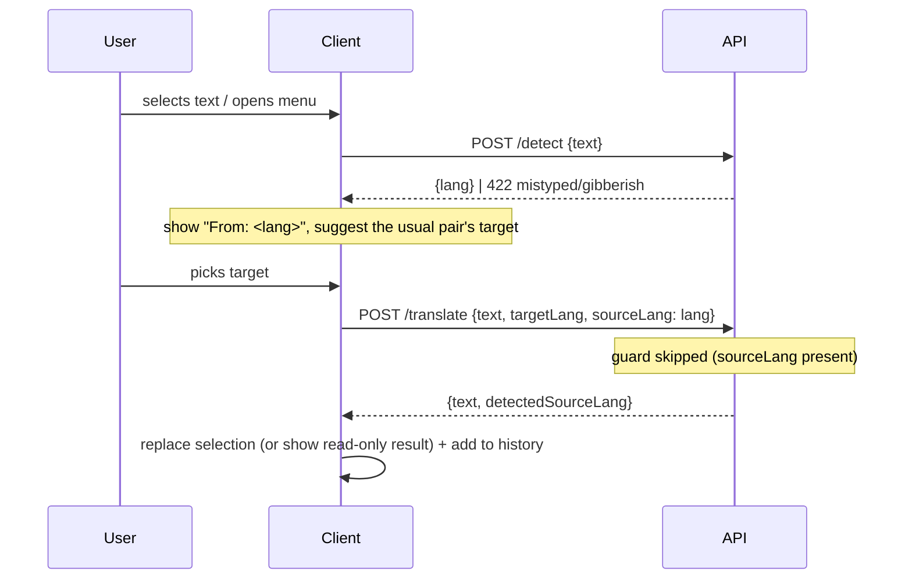
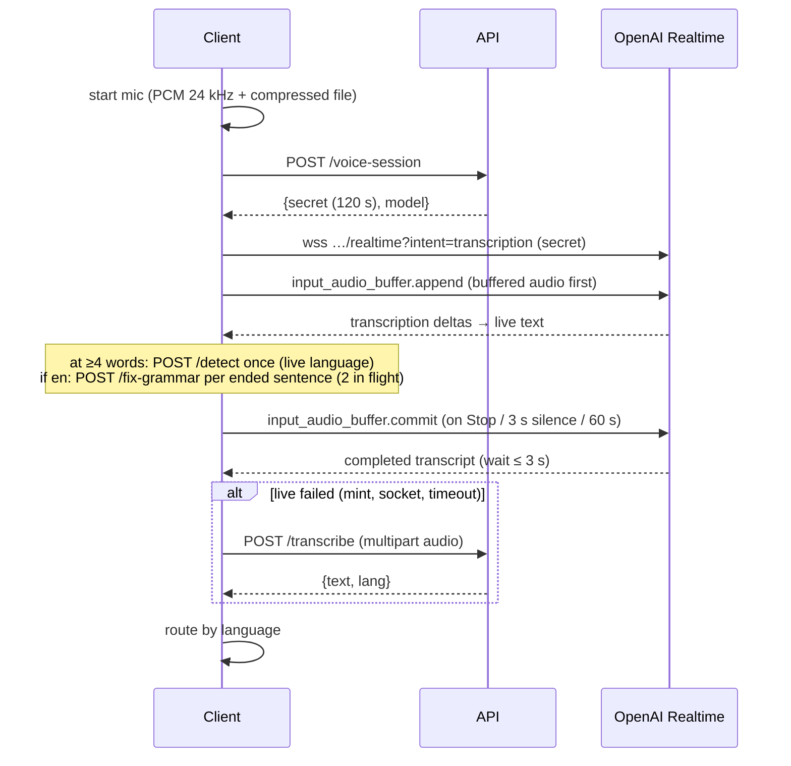

# Frontend (client as an abstract unit)

This document describes **what a client of the API is and must do**, independent of platform. The
Chrome extension is today's only client; a desktop app, a mobile keyboard, an IDE plugin or a web app
would be others. Everything here applies to all of them. Extension specifics live in
[extension.md](extension.md).

---

## 1. Responsibilities of any client

| A client owns | Because |
| --- | --- |
| **Getting and putting text** in the host (selection, focused field, caret, replace with undo) | Only the client can see and edit the host's text |
| **When to call the API**: debouncing/throttling, chunking text, prefetching, cancelling stale requests | Cost and latency are driven by call frequency; the API is stateless per request |
| **Applying results**: splicing translations and grammar edits into the user's text | The API returns offsets into the text it was sent, not into the host document |
| **Rendering**: icons, badges, menus, underlines, panels, notices | UI |
| **Auth session**: running OAuth (PKCE) against Supabase Auth, storing tokens, refreshing on demand | The API only verifies tokens |
| **Settings cache** and the default for empty favorites (from OS/browser languages) | The server cannot see the device's languages |
| **Local-only data**: history, stars, pinned languages, turned-off fields/sites per device | Product decision: not synced |
| **Microphone**: capture, PCM encoding, live Realtime socket, fallback upload | Audio never transits the API in the live path |
| **Local re-typing** of wrong-layout text (`switchLayout`) | A key-position map: free, instant, can't hallucinate |
| **Supplying context**: `url` (where the feature was used) | Analytics on the API side |

| A client must never | Because |
| --- | --- |
| Hold a provider key or call a provider directly (except the Realtime socket with an API-minted secret) | Anything shipped in a client is public |
| Compute grammar offsets itself or trust anything but the API's `edits` | The server diff is the contract |
| Send text the guard already rejected | It will 422 again and spend the user's rate limit |

---

## 2. Contract usage

Types: [`shared/contract.ts`](../shared/contract.ts). Language list: [`shared/contants.ts`](../shared/contants.ts)
(31 languages: `code`, English `name`, a native "Translating to …" label).

### Call wrapper rules (see `extension/src/api.ts` for a reference implementation)

1. `Authorization: Bearer <access token>` on every call; JSON body except `/transcribe` (multipart).
2. **Treat HTTP 401 as `unauthenticated` from the status**, never the body — the Supabase gateway's
   401 body is `{code, message}`, not `{error:{...}}`. On 401, drop the session and prompt sign-in.
3. Any other non-2xx: read `error.code` / `error.message`.
4. Distinguish "cancelled" (client abort) and "API unreachable" (network error) from API errors.
5. Respect the limits client-side so you don't spend requests on certain 400s: `MAX_TEXT_LENGTH` 5000,
   `MAX_AUDIO_BYTES` 5 MB, `MAX_FAVORITE_LANGUAGES` 20, `MAX_DISABLED_SITES` 100, `LANGUAGE_CODE`, `HOSTNAME`.

### Error code → UI

| Code | Expected client behaviour |
| --- | --- |
| `unauthenticated` | Show sign-in; remember what to resume (e.g. the target language) |
| `mistyped` | Offer the local re-type ("Fix the characters"); offer nothing that calls the API for this text |
| `gibberish` | Show "doesn't look like text"; disable all actions until the text changes |
| `rate-limited` | Back off; show a soft notice |
| `provider-failed` | Error with retry |
| `invalid-input` | Programming error or over-limit text |
| `mic-blocked` (client-side code) | Route the user to grant microphone permission |

---

## 3. Core flows (platform-agnostic)

### 3.1 Translate

Rules every client should keep:
- `"und"` = no detection: send no `sourceLang`. A failed detection must not block translating.
- Sending `sourceLang` (a) skips a second guard call (faster), (b) tells the API whether the detection was right.
- Before replacing, check the host text didn't change while the request ran; ignore stale responses (a generation counter).
- Mentions/links inside text are sent as `{{1}}`, `{{2}}` tokens and restored on write; the API keeps tokens verbatim.

### 3.2 Grammar (badge → underlines → panel)

1. **Check** (`POST /check`, cheap): error count + guard verdict. Drives the badge: `N` errors,
   ✓ clean, `!` wrong layout, `?` gibberish, red `!` check failed.
2. **Fix** (`POST /fix-grammar`, expensive): `{text, html, edits[]}`. Prefetch it as soon as a check
   reports > 0 errors, so a click opens instantly. Send `guarded: true` when a `/check` of the exact
   same text already answered.
3. **Render** `edits` as underlines (`kind: error` red, `native` blue), and a one-edit-at-a-time panel
   (`original → replacement`, `reason`, i of N).
4. **Apply** one edit: write `replacement` at `[start, end)` in the host, then **rebase** the remaining
   edits (shift offsets) instead of re-asking — `withoutFixEdit` in `core/fixEdits.ts`.
   Replace all = apply the rest in one write. Ignore = remember `original→replacement` for this field.

**Long text strategy** (current client; recommended for any client):
- Split into paragraphs (newlines; > 600 chars ⇒ sentence groups) and paragraphs into sentences
  (`Intl.Segmenter`); pieces under 3 words are never asked.
- `/check` each **ended** sentence, throttled every 300 ms while typing; the sentence being typed waits
  until it ends or the user pauses 1 s.
- `/fix-grammar` only paragraphs whose sentences sum > 0 errors; a paragraph whose checks all say 0 is
  never sent to OpenAI.
- Cache per field by exact text (each text asked once, ~100 per field), at most 2 in flight per pool,
  cancel requests for text edited away (except a fix already in flight, which is let finish into the cache).
- While an edited paragraph's new fix is pending, carry over still-valid edits from the previous version.
- Merge per-paragraph fixes into one whole-field fix (`mergeFixes`), so badge/underlines/panel see one result.
- Never auto-call for texts under 3 words or for single-line inputs (search boxes); a click still asks.

### 3.3 Wrong keyboard layout / gibberish

A 422 from any guarded call (or the check's verdict) replaces the normal UI:
- `mistyped` → layout card: struck-through text, `switchLayout(text)` preview, one action that replaces
  locally and re-checks. Currently EN ⇄ UK (RU letters accepted when converting back to Latin).
- `gibberish` → notice only; no actions until the text changes.

### 3.4 Voice input

Routing of the final transcript (any client):
- **English** → grammar panel on the transcript (sentence fixes reused; the rest asked; merged).
- **A language the user has a history pair for** → translate at once into that pair's target.
- **Otherwise** → language picker.
- Nothing is written into the host until the user presses **Insert** (or Copy).

Recording rules: stop at 60 s; stop after 3 s of silence (level < 0.08); live failures fall back to
upload silently; Cancel releases the mic. Optional: `POST /stats/dictation {seconds, words, model}` after
Stop (dev telemetry, fire-and-forget).

### 3.5 Auth

PKCE against Supabase Auth (`/auth/v1/authorize?provider=…&code_challenge=…&apikey=…` →
redirect with `code` → `POST /auth/v1/token?grant_type=pkce`). Store `{accessToken, refreshToken,
expiresAt}`; **refresh on demand** 60 s before expiry (`grant_type=refresh_token`), never on a timer;
a failed refresh = signed out. The client needs a redirect URL registered in
`[auth] additional_redirect_urls` and the Supabase publishable (anon) key.

### 3.6 Settings

- Server is the source of truth (`GET/PUT /settings`); the client keeps a cache for instant/offline reads.
- Save order: **API first, then cache**. Last write wins. PUT sends the **whole** `Settings`.
- Pull from the server right after sign-in so a second device shows the right languages.
- Empty `favoriteLanguages` = "not chosen yet": fill from device languages (`en-US` → `en`, only supported codes).

---

## 4. Client-side product logic (portable)

Pure TypeScript with no platform APIs, each with a unit test. This is the logic a new client would want
to **reuse as a package** (or that could be moved behind the API). Paths are under `extension/src/`.

| Module | What it decides |
| --- | --- |
| `core/languages.ts` | Supported-language lookup, search, native names, `browserLanguages()` default |
| `core/layout.ts` | `switchLayout` (QWERTY ⇄ ЙЦУКЕН), `layoutLanguages` |
| `core/fixEdits.ts` | `applyEdits`, `withoutFixEdit` (rebase after one Replace), `mergeFixes`, `cleanFix`, `isFinished`, `escapeHtml` |
| `widgets/translator/chunks.ts` | `splitChunks`, `splitSentences`, `isBeingTyped`, `carryOver`, `fixOf` |
| `widgets/translator/hooks/chunkRequests.ts` | Per-field request cache + bounded concurrency + cancel |
| `widgets/translator/hooks/requestSlot.ts` | One-in-flight request with stale-answer detection |
| `core/sentenceFixes.ts`, `core/liveLanguage.ts` | Fix-while-speaking and detect-while-speaking for dictation |
| `core/liveTranscript.ts`, `core/pcm.ts` | Realtime event → text assembly; Float32 → PCM16 base64 |
| `core/sites.ts` | `isSiteDisabled` (subdomain match), `parseSites` |
| `settings/history.ts` (pure parts) | `topPairs`, `pairFor`, `defaultPair`, `orient`, `intoLanguages`, `pinFirst`, `usedLately`, `byDay` |
| `widgets/translator/state.ts`, `view.ts` | Widget state machine (reducer) and state → view mapping |

Some of these are **policy** that arguably belongs to the API so every client behaves the same:
the "usual pair" suggestion, the paragraph/sentence chunking thresholds, and the "only fix paragraphs
whose checks found errors" rule. They are client-side today because they depend on local history and
on the edit loop's latency.

---

## 5. Client-owned data

| Data | Scope | Shape |
| --- | --- | --- |
| Session | device | `{accessToken, refreshToken, expiresAt, email?}` |
| Settings cache | device (mirror of server) | `Settings` |
| History | device only, last 200 | `{text, result, site, at, starred?, voice?} & ({kind?:'translation', from?, to} \| {kind:'grammar'})` |
| Pinned languages | device only | `string[]` |
| Turned-off fields | device only | `{site, key, label}[]` |

History is the input to pair suggestions and "used lately". Moving it server-side would make those
consistent across devices and clients — today a second client starts with no pairs.

---

## 6. Non-functional expectations

- **Latency budget**: `/check` ~0.3–0.9 s, `/fix-grammar` ~1.7–2.2 s (priority tier), detect is a guard + a classification. Prefetch and caching exist to hide these.
- **Cost**: every typing pause with ended sentences = one `/check` per sentence; paragraphs with errors add one fix each. The 60/min/user rate limit is shared by all features of a user.
- **Privacy**: text and page url are sent and logged by the API; audio goes to OpenAI directly (live) or via the API (fallback) and is not stored.
- **Offline / signed out**: settings come from cache; every feature needs the API and a session (except the local layout re-type).

---

## 7. Surfaces a client may implement

| Surface (extension name) | Generic role |
| --- | --- |
| In-page widget | Inline assistant attached to the host's text (selection icon, field icon, underlines, panels) |
| Toolbar popup | Standalone translator / scratchpad with history; can push text into the host ("Insert") |
| Options page | Account, settings, permissions |
| Offscreen recorder | Background audio capture service |

---

## 8. What a new client needs (and what is in the way)

Needs:
1. The contract types and language list.
2. An OAuth redirect registered with Supabase Auth, the Supabase URL and anon key, the API base URL.
3. Its origin in `ALLOWED_ORIGINS` (if it is a browser origin).
4. The flows in §3 and ideally the logic in §4.

In the way today:
- `shared/` is imported by **relative path** from both workspaces (`../../shared/contract`); there is no
  package, no version, no generated schema (OpenAPI/JSON Schema). A non-TS client must re-type it by hand.
- The portable logic in §4 is mixed into `extension/src/` (`widgets/translator/…`, `settings/history.ts`
  next to `chrome.storage` code). It would need extracting into e.g. `packages/client-core`.
- `url` and `disabledSites` are browser concepts baked into the contract and settings.
- No API versioning; the contract changes in lockstep with the extension.
